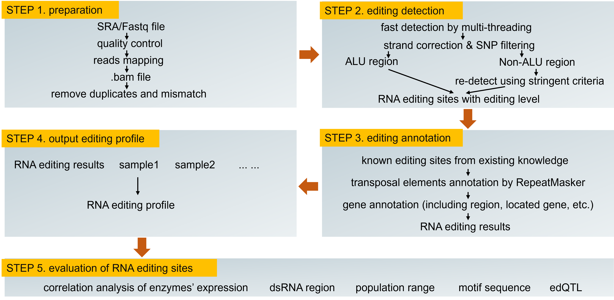

# EDKtoolkit
High quality RNA editing site identification processes in EDK database

To identify RNA editing sites both adenosine to inosine (A-to-I; inosine is further recognized as guanosine) and cytidine to uridine (C-to-U) editing types in transcriptome, EDK 2.0 adopted a high-quality unified pipeline based on REDItools 2.0 (1). First, we developed a computational pipeline named GENtoolkit (https://ngdc.cncb.ac.cn/gen/toolkit): (i) Fastp (2) was used for trimming and filtering raw reads; (ii) HISAT2 (3) was used to evaluate data quality, including mapping quality and coverage; and (iii) high-quality RNA-seq reads were aligned to the human reference genome (hg38) by STAR alignment software (4). Second, a fast detection method by multi-threading based on REDItools was used to identify RNA editing sites per sample. Third, to reduce the false positives in RNA editing, Pblat (5) was used to discover mismatched or multimapping RNA-seq reads, and samtools (6) was used to delete deduplicated reads. SNP file was downloaded from UCSC (http://hgdownload.soe.ucsc.edu/) to filter SNP sites. All known RNA editing site annotations were retrieved from the REDIportal (7), DARNED (8), and RepeatMasker (9). Gene annotation file was downloaded from GENCODE (10).

Reference
1.	Lo Giudice, C., Tangaro, M.A., Pesole, G. and Picardi, E. (2020) Investigating RNA editing in deep transcriptome datasets with REDItools and REDIportal. Nat Protoc, 15, 1098-1131.
2.	Chen, S., Zhou, Y., Chen, Y. and Gu, J. (2018) fastp: an ultra-fast all-in-one FASTQ preprocessor. Bioinformatics, 34, i884-i890.
3.	Pertea, M., Kim, D., Pertea, G.M., Leek, J.T. and Salzberg, S.L. (2016) Transcript-level expression analysis of RNA-seq experiments with HISAT, StringTie and Ballgown. Nat Protoc, 11, 1650-1667.
4.	Dobin, A., Davis, C.A., Schlesinger, F., Drenkow, J., Zaleski, C., Jha, S., Batut, P., Chaisson, M. and Gingeras, T.R. (2013) STAR: ultrafast universal RNA-seq aligner. Bioinformatics, 29, 15-21.
5.	Wang, M. and Kong, L. (2019) pblat: a multithread blat algorithm speeding up aligning sequences to genomes. BMC Bioinformatics, 20, 28.
6.	Li, H., Handsaker, B., Wysoker, A., Fennell, T., Ruan, J., Homer, N., Marth, G., Abecasis, G., Durbin, R. and Genome Project Data Processing, S. (2009) The Sequence Alignment/Map format and SAMtools. Bioinformatics, 25, 2078-2079.
7.	Picardi, E., D'Erchia, A.M., Lo Giudice, C. and Pesole, G. (2017) REDIportal: a comprehensive database of A-to-I RNA editing events in humans. Nucleic Acids Res, 45, D750-D757.
8.	Ramaswami, G. and Li, J.B. (2014) RADAR: a rigorously annotated database of A-to-I RNA editing. Nucleic Acids Res, 42, D109-113.
9.	Tarailo-Graovac, M. and Chen, N. (2009) Using RepeatMasker to identify repetitive elements in genomic sequences. Curr Protoc Bioinformatics, 4, 11-14.
10.	Frankish, A., Diekhans, M., Ferreira, A.M., Johnson, R., Jungreis, I., Loveland, J., Mudge, J.M., Sisu, C., Wright, J., Armstrong, J. et al. (2019) GENCODE reference annotation for the human and mouse genomes. Nucleic Acids Res, 47, D766-D773.

Note that due to storage limitations, for more requests please contact: zhutongtong@big.ac.cn
